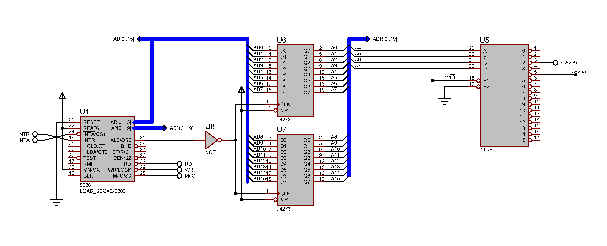
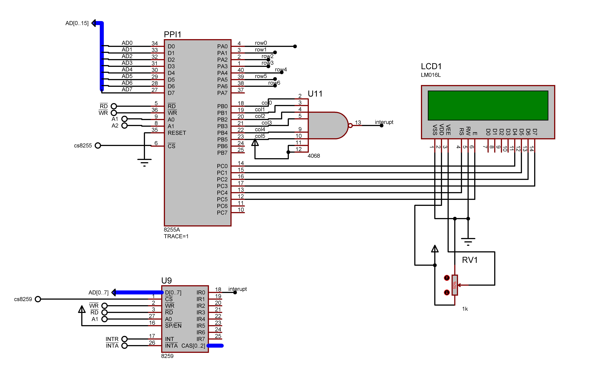
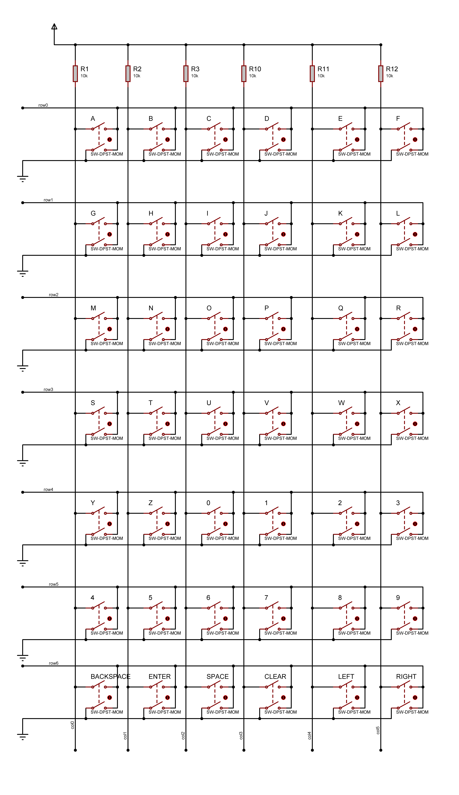

# 8086 Interrupt-Driven Keypad & LCD Terminal

## Table of Contents
1.  [Project Overview](#1-project-overview)
2.  [Tools & Setup](#11-tools--setup)
3.  [Showcase](#12-showcase)
4.  [Hardware Architecture](#2-hardware-architecture)
    * [8255 PPI Interface](#21-8255-ppi-parallel-io-interface)
    * [8259 PIC Interface](#22-8259-pic-interrupt-controller)
    * [7x6 Matrix Keypad](#23-7x6-matrix-keypad-sw-dpst-mom)
    * [16x2 LCD Display](#24-16x2-lcd-display)
5.  [Design Logic: Addressing & Banking](#3-design-logic-addressing--banking)
6.  [Device Configuration](#4-device-configuration)
7.  [Software Architecture](#5-software-architecture)
8.  [Operation Flow](#6-operation-flow)
9.  [Source Code](#7-source-code)

---

## 1. Project Overview
This system implements a fully functional character entry terminal using an **8086 Microprocessor**. It interfaces a custom **7x6 Matrix Keypad** and a **16x2 LCD Display** to allow users to type, edit, and view text.

Unlike simple polling systems which waste CPU cycles constantly checking pins, this project utilizes an **Interrupt-Driven Architecture** via the **8259 PIC**. The CPU remains free to process data or idle until a key is physically pressed, ensuring high efficiency and zero missed keystrokes.

**Key Features:**
* **7x6 Matrix Support:** Handles 42 distinct keys including A-Z, 0-9, and special control keys.
* **Special Functions:** Supports **Backspace**, **Enter**, **Clear Screen**, and **Cursor Navigation** (Left/Right).
* **Circular Buffer:** Implements a software queue to decouple high-speed ISR execution from display rendering.
* **4-Bit LCD Mode:** Optimized wiring using nibble-swapping logic to save I/O pins.

## 1.1 Tools & Setup
* **Assembler:** MASM / TASM (Code is written in standard MASM syntax).
* **Simulation:** Proteus Design Suite (recommended for hardware simulation).
* **Key Components:**
    * 8086 Microprocessor (CPU)
    * 8255 PPI (Parallel Interface)
    * 8259 PIC (Interrupt Controller)
    * 16x2 LCD (LM016L)
    * Keypad (Custom 7x6 Matrix using SW-DPST-MOM)

## 1.2 Showcase
See the system in action:
[**Click here to watch the demonstration video**](./video_filename.mp4)
*(Replace `video_filename.mp4` with your actual video file name)*

---

## 2. Hardware Architecture

**For a complete visual reference of the wiring and schematic, please refer to:**


**8086, Address latches and decoder schematic:**


**PPI, PIC and LCD Schematic:**


**Keyboard Matrix Schematic:**


## 
### 2.1 8255 PPI (Parallel I/O Interface)
The 8255 acts as the primary "bridge," expanding the 8086's data bus into 24 distinct I/O pins.
* **Base Address:** `0040h`
* **Port A (Input):** Reads the **7 Row Lines**. The ISR reads this port and looks for the bit that has dropped to **0** (Grounded).
* **Port B (Input):** Reads the **6 Column Lines**. The ISR reads this port and looks for the bit that has dropped to **0** (Grounded).
* **Port C (Output):** Connected to the **LCD**. Since the LCD is a passive device, the CPU must drive data *out* to it.

### 2.2 8259 PIC (Interrupt Controller)
[Image of 8259 PIC block diagram]

The 8259 manages hardware signals.
* **Base Address:** `0020h` (Command), `0022h` (Data).
* **IR0 (Input):** Connected to the output of the Keypad **NOR Gate**.
    * The 8259 IRQ0 pin is **Active High**.
    * When a key is pressed, the columns go Low. The NOR Gate inverts this logic to send a **High** signal to the 8259.
* **INT (Output):** Connects to the 8086 `INTR` pin.
* **INTA (Input):** Connects to the 8086 `INTA` pin to acknowledge the request.

### 2.3 7x6 Matrix Keypad (SW-DPST-MOM)
[Image of matrix keypad internal circuit]

This project uses **SW-DPST-MOM** (Double Pole Single Throw - Momentary) switches to simplify detection logic.

* **Switch Mechanics:**
    * **Top Pole (Signal):** Connected to both the specific **Row wire** and the specific **Column wire**.
    * **Bottom Pole (Common):** Connected permanently to **Ground**.
* **Default State:** All Row and Column lines are pulled to **VCC (High/Logic 1)** via pull-up resistors.
* **Active State:** When a key is pressed, the switch connects the Top Pole to the Bottom Pole. This creates a direct path to Ground for **both** the Row wire and the Column wire simultaneously, pulling them to **Logic 0**.
* **Interrupt Logic:** A **NOR Gate** (Negative-Input OR) monitors the 6 Column lines.
    * **Standby:** All inputs are 1. Output is 0.
    * **Key Press:** One input drops to 0. The NOR Gate detects this change and outputs a **Logic 1** to trigger the 8259.

### 2.4 16x2 LCD Display
[Image of 16x2 LCD pinout]

To save pins on the 8255 (allowing us to use Ports A & B entirely for the keypad), we drive the LCD in **4-Bit Mode**.
* **Data (D4-D7):** Connected to Port C (PC0-PC3). We send 8-bit characters in two 4-bit chunks ("nibbles").
* **Control:** `RS` (Register Select) and `E` (Enable) are controlled by PC4 and PC5.

---

## 3. Design Logic: Addressing & Banking

### Why Addresses `40, 42, 44` instead of `40, 41, 42`?
A critical design choice was skipping odd addresses to handle the **8086 Memory Banking**.

**The Technical Issue:**
The 8086 has a 16-bit data bus split into two 8-bit banks:
1.  **Lower Bank (D0-D7):** Active on **Even Addresses** (A0=0).
2.  **Upper Bank (D8-D15):** Active on **Odd Addresses** (A0=1).

**The Mismatch:**
Our peripherals (8255/8259) are **8-bit devices** wired physically to the **Lower Data Bus (D0-D7)**.
* If we accessed an **Odd Address** (e.g., `41h`), the CPU would activate the Upper Bank (D8-D15). Since our chip is wired to D0-D7, the CPU would miss the device entirely.
* By using only **Even Addresses** (`40h, 42h, 44h`), we force the CPU to always use the Lower Bank (D0-D7), ensuring correct communication.

**Address Folding:**
To support this in hardware, the address lines are shifted: `CPU A1` connects to `Chip A0`, and `CPU A2` connects to `Chip A1`.

---

## 4. Device Configuration

### 4.1 8255 Control Word: `92h`
**Value:** `1001 0010` (Binary)
We use **Mode 0** (Basic I/O). The input ports are read directly by the CPU to detect which pins have been grounded (pulled to 0).
* **Port A (Input):** Listening to Rows.
* **Port B (Input):** Listening to Columns.
* **Port C (Output):** Driving the LCD.

### 4.2 8259 PIC Configuration
* **Triggering (ICW1 = `13h`):** Configured for **Edge Triggering**. This ensures a single keypress generates only one interrupt.
* **Vector Mapping (ICW2 = `08h`):** We map our keypad interrupt to **INT 08h**. This ensures it doesn't conflict with Intel's reserved internal interrupts (0-4).
* **Masking (OCW1 = `FEh`):** We set the mask to `1111 1110`. This enables **only IRQ0** (Keypad) and disables all other noise sources.

---

## 5. Software Architecture

To ensure the system is responsive, we separated the logic into two distinct "Loops" or processes that communicate via a buffer.

### 5.1 The Fast Loop: Interrupt Service Routine (ISR)
The `KEY_ISR` is designed to be extremely fast. It executes only when a key is pressed.
1.  **Capture:** It immediately reads Port A and Port B to "freeze" the state of the keypad. The code scans the bytes to find the bit position that is **0**.
2.  **Translate:** It calculates the key index and looks up the ASCII character in the `KEYMAP` table.
3.  **Buffer:** Instead of trying to draw to the screen (which is slow), it simply pushes the character into a **Circular Queue** and returns control to the main program.

### 5.2 The Slow Loop: Main Application
The `MAIN_LOOP` runs continuously in the background.
1.  **Monitor:** It constantly checks if the Circular Queue has new data (`Head != Tail`).
2.  **Process:** If data is found, it pops the character.
3.  **Execute:** It checks if the character is special (e.g., `08h` for Backspace). If it's a normal character, it calls the **LCD Driver** to update the display.
    * *This separation ensures that if the LCD takes 2ms to update, the user can still type fast without losing keystrokes.*

---

## 6. Operation Flow

1.  **Standby:** All Row and Column lines are pulled High (Logic 1) by resistors. CPU loops in `MAIN_LOOP`.
2.  **Action:** User presses 'A'. The SW-DPST switch connects the signal lines to Ground.
3.  **Hardware State:** This single action pulls both **Row 0** and **Column 0** to **Logic 0**.
4.  **Interrupt Trigger:** The **NOR Gate** detects the Logic 0 on Column 0. It inverts this to a **Logic 1**, which triggers **8259 IRQ0**.
5.  **Capture:** CPU pauses, jumps to `KEY_ISR`, reads Port A (detects Row 0 is Low) and Port B (detects Col 0 is Low), pushes 'A' to the Queue.
6.  **Display:** Main loop wakes up, pops 'A', and sends it to the LCD via Port C.

---

## 7. Source Code

```assembly
; ==============================================
;  7x6 Keyboard -> A-Z, 0-9, BS, ENT, SP, CLR, <, >
;  ISR pushes ASCII to queue
;  Main loop processes keys
; ==============================================

CODE    SEGMENT PARA 'CODE'
        ASSUME CS:CODE, DS:DATA, SS:STAK

DATA    SEGMENT PARA 'DATA'
    LATEST_ROW_DETECTED DB ?
    LATEST_COL_DETECTED DB ?
    PORTAREAD  DB ?
    PORTBREAD  DB ?

    ; --- Keymap for 7x6 (42 keys) ---
    KEYMAP DB 'A','B','C','D','E','F','G','H','I','J','K','L','M', \
             'N','O','P','Q','R','S','T','U','V','W','X','Y','Z', \
             '0','1','2','3','4','5','6','7','8','9', \
             08h, 0Dh, ' ', 0Ch, 01h, 02h ; Row 6: BS, ENTER, SPACE, CLR, LEFT, RIGHT

    ; Masks
    MASK_HIGH   DB 0F0h
    MASK_LOW    DB 0Fh
    MASK_E_SET  DB 20h 
    MASK_RS_SET DB 10h
    
    ; Queue & Buffer
    Q_SIZE      EQU 16
    KEY_QUEUE   DB Q_SIZE DUP(0)
    Q_HEAD      DB 0
    Q_TAIL      DB 0
    
    CURSOR_POS  DB 0
    GREET_MSG   DB 'START', 0  
    IS_FIRST_KEY DB 1
    
    ; 32-byte buffer to hold screen contents
    SCREEN_BUFFER DB 32 DUP(' ') 
    
DATA    ENDS

STAK    SEGMENT PARA STACK 'STACK'
        DW 64 DUP(?) 
STAK    ENDS

PORTA       EQU 0040h
PORTB       EQU 0042h
PORTC       EQU 0044h
CONTROL8255 EQU 0046h
COMMAND8259 EQU 0020h
DATA8259    EQU 0022h

; ==============================================
START PROC
; ==============================================
    MOV AX, DATA
    MOV DS, AX

    ; Init 8255: Port A/B Input, Port C Output
    MOV DX, CONTROL8255
    MOV AL, 092h
    OUT DX, AL

    CALL LCD_INIT
    CALL PRINT_GREETING

    ; Init 8259
    MOV AL, 013h
    OUT COMMAND8259, AL
    IN  AL, COMMAND8259
    MOV AL, 08h
    OUT DATA8259, AL
    IN  AL, DATA8259
    MOV AL, 01h
    OUT DATA8259, AL
    IN  AL, DATA8259
    MOV AL, 0FEh  ; Unmask IRQ0 only
    OUT DATA8259, AL
    STI

    ; Setup IVT (Using ES temporary switch)
    XOR AX, AX
    MOV ES, AX
    MOV WORD PTR ES:[8], OFFSET DUMMY_NMI
    MOV WORD PTR ES:[10], CS
    MOV WORD PTR ES:[8*4], OFFSET KEY_ISR
    MOV WORD PTR ES:[8*4+2], CS

    MOV AX, DS
    MOV ES, AX

MAIN_LOOP:
    CALL PROCESS_QUEUE
    JMP MAIN_LOOP
START ENDP

; ==============================================
;  Keyboard ISR (7x6 Matrix)
; ==============================================
KEY_ISR PROC NEAR
    PUSH AX
    PUSH BX
    PUSH CX
    PUSH DX
    PUSH SI

    MOV DX, PORTA
    IN  AL, DX
    MOV [PORTAREAD], AL

    XOR BX, BX
FIND_ROW:
    TEST AL, 1
    JZ  FOUND_ROW
    INC BL
    SHR AL, 1
    CMP BL, 7
    JB  FIND_ROW
    JMP EXIT_ISR

FOUND_ROW:
    MOV [LATEST_ROW_DETECTED], BL
    MOV DX, PORTB
    IN  AL, DX
    MOV [PORTBREAD], AL

    XOR BX, BX
FIND_COL:
    TEST AL, 1
    JZ  FOUND_COL_OK
    INC BL
    SHR AL, 1
    CMP BL, 6
    JB  FIND_COL
    JMP EXIT_ISR

FOUND_COL_OK:
    MOV [LATEST_COL_DETECTED], BL

    ; Calculate Index = (Row * 6) + Col
    MOV AL, [LATEST_ROW_DETECTED]
    MOV BL, 6
    MUL BL                  
    ADD AL, [LATEST_COL_DETECTED] 

    CMP AL, 41 
    JA  EXIT_ISR

    LEA SI, KEYMAP          
    MOV BL, AL              
    XOR BH, BH              
    MOV AL, BYTE PTR [SI + BX] 

    CMP AL, 0 
    JE  EXIT_ISR

    ; Add to Circular Queue
    MOV DL, [Q_TAIL]        
    MOV DH, DL
    INC DL
    CMP DL, Q_SIZE
    JB  NEXT_OK_ISR
    MOV DL, 0
NEXT_OK_ISR:
    CMP DL, [Q_HEAD]
    JE  QUEUE_FULL_ISR

    LEA SI, KEY_QUEUE
    MOV BL, DH              
    XOR BH, BH
    ADD SI, BX
    MOV BYTE PTR [SI], AL
    MOV [Q_TAIL], DL

QUEUE_FULL_ISR:
EXIT_ISR:
    MOV AL, 020h ; EOI
    OUT COMMAND8259, AL

    POP SI
    POP DX
    POP CX
    POP BX
    POP AX
    IRET
KEY_ISR ENDP

; ==============================================
;  Process Queue (Logic Handler)
; ==============================================
PROCESS_QUEUE PROC NEAR
    PUSH AX
    PUSH BX
    PUSH CX
    PUSH DX
    PUSH SI
    PUSH DI

NEXT_KEY:
    MOV AL, [Q_HEAD]
    MOV BL, [Q_TAIL]
    CMP AL, BL
    JE  NO_KEYS

    LEA SI, KEY_QUEUE
    MOV BL, AL            
    XOR BH, BH
    ADD SI, BX
    MOV DL, BYTE PTR [SI]   

    INC AL
    CMP AL, Q_SIZE
    JB  HEAD_OK
    MOV AL, 0
HEAD_OK:
    MOV [Q_HEAD], AL

    ; Check First Key
    MOV CL, [IS_FIRST_KEY]
    CMP CL, 0
    JE  NOT_FIRST_KEY_MAIN 
    
    MOV BYTE PTR [IS_FIRST_KEY], 0 
    MOV AL, 001h
    CALL LCD_CMD            
    LEA DI, SCREEN_BUFFER
    MOV AL, ' '
    MOV CX, 32
    REP STOSB
    MOV BYTE PTR [CURSOR_POS], 0 

NOT_FIRST_KEY_MAIN:
    ; Special Key Handling
    CMP DL, 08h  
    JE  HANDLE_BACKSPACE
    CMP DL, 0Dh  
    JE  HANDLE_ENTER
    CMP DL, 0Ch  
    JE  HANDLE_CLEAR
    CMP DL, 01h  
    JE  HANDLE_CURSOR_LEFT
    CMP DL, 02h  
    JE  HANDLE_CURSOR_RIGHT
    
    JMP HANDLE_PRINTABLE

HANDLE_BACKSPACE:
    MOV CL, [CURSOR_POS]
    CMP CL, 0
    JE  KEY_PROCESSED        
    DEC CL                  
    MOV [CURSOR_POS], CL
    LEA SI, SCREEN_BUFFER
    XOR CH, CH              
    ADD SI, CX
    MOV BYTE PTR [SI], ' '
    MOV AL, CL
    CALL SET_HW_CURSOR
    MOV AL, ' '
    CALL LCD_DATA
    MOV AL, CL
    CALL SET_HW_CURSOR
    JMP KEY_PROCESSED       
    
HANDLE_ENTER:
    MOV CL, [CURSOR_POS]
    CMP CL, 16
    JAE ENTER_ON_L2         
ENTER_ON_L1:
    MOV CH, 16              
    JMP ENTER_FILL_LOOP
ENTER_ON_L2:
    MOV CH, 32              
ENTER_FILL_LOOP:
    MOV CL, [CURSOR_POS]
    CMP CL, CH              
    JE  KEY_PROCESSED       
    MOV DL, ' '
    
    MOV CL, [CURSOR_POS]
    CMP CL, 32
    JNE NO_SCROLL_ENTER
    CALL UPDATE_BUFFER_AND_SCROLL 
    CALL LCD_REDRAW_ALL
    JMP ENTER_FILL_LOOP            
NO_SCROLL_ENTER:
    CALL UPDATE_BUFFER_AND_SCROLL 
    MOV AL, [CURSOR_POS]
    DEC AL
    CALL SET_HW_CURSOR
    MOV AL, DL
    CALL LCD_DATA
    MOV AL, [CURSOR_POS]
    CMP AL, 32
    JE ENTER_FILL_LOOP
    CALL SET_HW_CURSOR
    JMP ENTER_FILL_LOOP            

HANDLE_CLEAR:
    MOV AL, 001h
    CALL LCD_CMD            
    LEA DI, SCREEN_BUFFER
    MOV AL, ' '
    MOV CX, 32
    REP STOSB
    MOV BYTE PTR [CURSOR_POS], 0 
    JMP KEY_PROCESSED       

HANDLE_CURSOR_LEFT:
    MOV CL, [CURSOR_POS]
    CMP CL, 0
    JE  KEY_PROCESSED        
    DEC CL                  
    MOV [CURSOR_POS], CL
    MOV AL, CL              
    CALL SET_HW_CURSOR      
    JMP KEY_PROCESSED       

HANDLE_CURSOR_RIGHT:
    MOV CL, [CURSOR_POS]
    CMP CL, 32
    JE  KEY_PROCESSED        
    INC CL                  
    MOV [CURSOR_POS], CL
    MOV AL, CL              
    CALL SET_HW_CURSOR      
    JMP KEY_PROCESSED       

HANDLE_PRINTABLE:
    MOV CL, [CURSOR_POS]
    CMP CL, 32
    JNE NO_SCROLL_REDRAW
    CALL UPDATE_BUFFER_AND_SCROLL 
    CALL LCD_REDRAW_ALL            
    JMP KEY_PROCESSED
    
NO_SCROLL_REDRAW:
    CALL UPDATE_BUFFER_AND_SCROLL 
    MOV AL, [CURSOR_POS]
    DEC AL                      
    CALL SET_HW_CURSOR          
    MOV AL, DL                  
    CALL LCD_DATA               
    MOV AL, [CURSOR_POS]
    CMP AL, 32
    JE KEY_PROCESSED
    CALL SET_HW_CURSOR
    
KEY_PROCESSED:
    JMP NEXT_KEY                

NO_KEYS:
    POP DI
    POP SI
    POP DX
    POP CX
    POP BX
    POP AX
    RET
PROCESS_QUEUE ENDP

; ==============================================
;  Delay Helpers
; ==============================================
DELAY_SHORT PROC NEAR
    PUSH CX
    MOV CX, 50
D1_LOOP:
    NOP
    NOP
    LOOP D1_LOOP
    POP CX
    RET
DELAY_SHORT ENDP

DELAY_2MS PROC NEAR
    PUSH CX
    MOV CX, 2000
D2_LOOP:
    NOP
    LOOP D2_LOOP
    POP CX
    RET
DELAY_2MS ENDP

DELAY_20MS PROC NEAR
    PUSH CX
    MOV CX, 20000
D3_LOOP:
    NOP
    LOOP D3_LOOP
    POP CX
    RET
DELAY_20MS ENDP

; ==============================================
;  LCD Routines
; ==============================================
LCD_PULSE_E PROC NEAR
    PUSH CX 
    PUSH DX
    MOV DX, PORTC
    OUT DX, AL
    MOV CL, BYTE PTR [MASK_E_SET]
    OR  AL, CL
    OUT DX, AL
    CALL DELAY_SHORT
    MOV CL, BYTE PTR [MASK_E_SET]
    XOR AL, CL
    OUT DX, AL
    CALL DELAY_SHORT
    POP DX
    POP CX
    RET
LCD_PULSE_E ENDP

LCD_WRITE PROC NEAR
    PUSH AX
    PUSH BX
    PUSH CX 
    PUSH DX
    MOV DL, AL
    MOV AL, DL
    MOV CL, BYTE PTR [MASK_HIGH]
    AND AL, CL
    MOV CL, 4
    SHR AL, CL
    CMP BH, 0
    JE  HW_NO_RS
    MOV CL, BYTE PTR [MASK_RS_SET]
    OR  AL, CL
HW_NO_RS:
    CALL LCD_PULSE_E
    MOV AL, DL
    MOV CL, BYTE PTR [MASK_LOW]
    AND AL, CL
    CMP BH, 0
    JE  LW_NO_RS
    MOV CL, BYTE PTR [MASK_RS_SET]
    OR  AL, CL
LW_NO_RS:
    CALL LCD_PULSE_E
    POP DX
    POP CX  
    POP BX
    POP AX
    RET
LCD_WRITE ENDP

LCD_CMD PROC NEAR
    PUSH AX
    PUSH BX
    MOV BH, 0
    CALL LCD_WRITE
    CALL DELAY_2MS
    POP BX
    POP AX
    RET
LCD_CMD ENDP

LCD_DATA PROC NEAR
    PUSH AX
    PUSH BX
    MOV BH, 1
    CALL LCD_WRITE
    CALL DELAY_SHORT
    POP BX
    POP AX
    RET
LCD_DATA ENDP

LCD_INIT PROC NEAR
    PUSH AX
    CALL DELAY_20MS
    MOV AL, 033h 
    MOV BH, 0
    CALL LCD_WRITE
    MOV AL, 032h
    MOV BH, 0
    CALL LCD_WRITE
    MOV AL, 028h  
    CALL LCD_CMD
    MOV AL, 00Ch  
    CALL LCD_CMD
    MOV AL, 006h  
    CALL LCD_CMD
    MOV AL, 001h  
    CALL LCD_CMD
    POP AX
    RET
LCD_INIT ENDP

; ==============================================
;  Buffer/Scroll Logic
; ==============================================
UPDATE_BUFFER_AND_SCROLL PROC NEAR
    PUSH AX
    PUSH CX
    PUSH SI
    PUSH DI
    MOV CL, [CURSOR_POS]
    CMP CL, 32  
    JNE NO_SCROLL
    LEA SI, SCREEN_BUFFER + 16 
    LEA DI, SCREEN_BUFFER      
    MOV CX, 16
    REP MOVSB
    LEA DI, SCREEN_BUFFER + 16 
    MOV AL, ' '
    MOV CX, 16
    REP STOSB
    MOV CL, 16
NO_SCROLL:
    LEA SI, SCREEN_BUFFER
    XOR CH, CH  
    ADD SI, CX
    MOV BYTE PTR [SI], DL 
    INC CL
    MOV [CURSOR_POS], CL
    POP DI
    POP SI
    POP CX
    POP AX
    RET
UPDATE_BUFFER_AND_SCROLL ENDP

LCD_REDRAW_ALL PROC NEAR
    PUSH AX
    PUSH BX
    PUSH CX
    PUSH SI
    MOV AL, 02h
    CALL LCD_CMD
    LEA SI, SCREEN_BUFFER
    MOV CX, 16
L1_LOOP:
    MOV AL, [SI]
    CALL LCD_DATA
    INC SI
    LOOP L1_LOOP
    MOV AL, 0C0h
    CALL LCD_CMD
    MOV CX, 16
L2_LOOP:
    MOV AL, [SI]
    CALL LCD_DATA
    INC SI
    LOOP L2_LOOP
    MOV AL, [CURSOR_POS] 
    CALL SET_HW_CURSOR
    POP SI
    POP CX
    POP BX
    POP AX
    RET
LCD_REDRAW_ALL ENDP

SET_HW_CURSOR PROC NEAR
    PUSH AX
    PUSH BX
    MOV BH, AL
    CMP AL, 16
    JNB CUR_ON_L2_B
CUR_ON_L1_B:
    ADD AL, 80h
    CALL LCD_CMD
    JMP CUR_DONE_B
CUR_ON_L2_B:
    SUB AL, 16
    ADD AL, 0C0h
    CALL LCD_CMD
CUR_DONE_B:
    MOV AL, BH
    POP BX
    POP AX
    RET
SET_HW_CURSOR ENDP

PRINT_GREETING PROC NEAR
    PUSH AX
    PUSH SI
    PUSH DX
    LEA SI, GREET_MSG
PRINT_LOOP:
    MOV AL, BYTE PTR [SI]
    CMP AL, 0
    JE  PRINT_DONE
    MOV DL, AL
    CALL UPDATE_BUFFER_AND_SCROLL
    INC SI
    JMP PRINT_LOOP
PRINT_DONE:
    CALL LCD_REDRAW_ALL
    POP DX
    POP SI
    POP AX
    RET
PRINT_GREETING ENDP

DUMMY_NMI PROC NEAR
    IRET
DUMMY_NMI ENDP

CODE ENDS

END START

